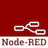

# Abstract Code Programming

### Develop by using abstract methods and technologies. Beyond "Low Code".

> This is a collection of ressources, publications, tutorials and projects about the concept of ***Abstract Code***

Welcome to "Abstract Code Programming". This site is to show and discuss approaches for building software in an abstract and versatile way. Approaches, that go beyond hard core programming but also beyond "Low Code".

This site will show examples with the following technologies:

| Project        | Description           |
| ------------- |:-------------|
|  | Puzzle. An abstract programming language |
|  | Node-RED. Flow-based, graphical programming |

## What is this site about?

First of all, this site is an open project. Everybody is welcome to contribute content, ideas, tutorials or projects.

You will:

* ***Learn*** about abstract ways to develop software
* ***See*** different approaches for different problems
* ***Develop*** software using abstract programming languages

## Author

My name is Marco, a Computer Science Master with a deep passion for abstraction. I am working on this site to provide a platform for people who want to build software in a simple but versatile fashion. I really hope this site will be joined by other collaborators, exchainging ideas, concepts and solutions for making computer programming more abstract.

Find out more here.