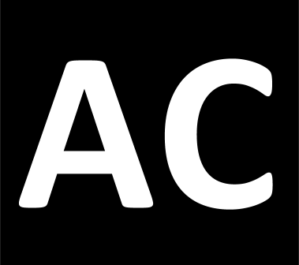

# Abstract Code Programming

Welcome to "Abstract Code" Programming. This publication is to show and discuss approaches for building software using ***real programming*** code in an abstract and versatile way. Approaches, that go beyond hard-core programming but also beyond "Low Code". You will:

* ***Learn*** about abstract ways to develop software
* ***See*** different approaches for different problems
* ***Develop*** software using abstract programming languages

### TL;DR

> Abstract Code Programing doesn't have an official definition. It is discussed here as a development approach that aims to provide a way to develop software using programming languages that are designed with abstract principles and are accessible even for non programmers.

---

# Projects

As part of this publication, some technologies that make abstract coding possible, are being created and discussed. There technologies are open source.

| Project |  Category  | Description   |
| ------------- | :------------- |:-------------|
| Ressources | Publication   | This publication is the main part of the abstract code project. It features ressources for learning and discussing |
|  PUZZLE | Abstract Programming Language | When we talk about abstract code, we need an abstract programming language. The PUZZLE project is an approach to  reate a real programmming language, that is designed with abstraction in mind. Along with the resources shown in this publication, PUZZLE will be discussed. |
|  OBJY | Abstract Framework | Besides having a language for development, frameworks are a must-use for building software. OBJY is a framework, that works with behaviour-driven, dynamic objects as piece of abstraction. |

---

# Content

This publication is structured into multiple chapters, of which each can be consumed separately. However, it cannot hurt to read the content in the order it is presented.

| Chapter       | Content           |
| ------------- |:-------------|
| [Intro](README) | What this publication is all about |
| [Basics](BASICS) | Learn about the basics needed to understand programming |
| [Abstraction](Abstraction) | Learn about abstraction and how computers use it to work |

# Roadmap

The following chapters are being created:

- [x] <b>Intro</b>
- [x] <b>Basics </b>
	- Some important basics
- [ ] <b>Abstract Development </b>
	- What is abstraction and how does it work in computers? What are existing approaches to develop software using abstract methodologies?
- [ ] <b>Abstract Code</b>
	- What is Abstract Code ?
- [ ] <b>Language Guide</b>
	- Learn the PUZZLE abstract programming language
- [ ] <b>Start building</b>
	- Create projects using PUZZLE